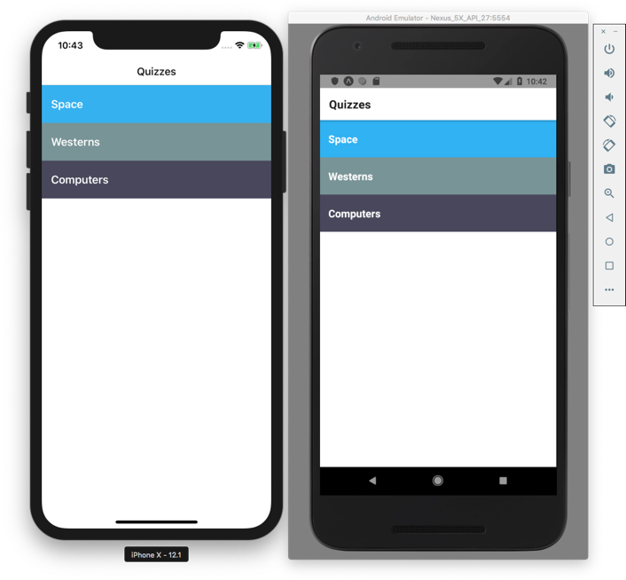
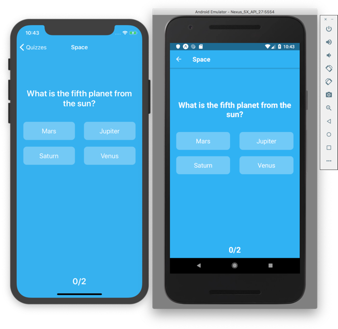

## React Native Quiz App

estuve buscando proyectitos sencillos para aprender
 me trinque este, que consegui que funcionara
 https://github.com/ReactNativeSchool/react-native-quiz
 de aqui:
 https://github.com/ReactNativeNews/React-Native-Apps
 tal y como pone el colega en su readme-md solo hay que 
- ( hay que tener el emulador andando )
- bajarselo
- yarn install
- npm run android
  - o tambien : yarn run android 
- hay que esperar a que salga el codigo qr en consola
  - tambien se abre una pagina con el menu developer expo en el explorer
- hay que ponerlo en conexion 'tunnel'
- en el explorador de pincha en adroid, o en la consola se pulsa a, y listo, sale la aplicacioncita en el emulador de movil

y cuidado, porque a veces falla a la 1', y no es capaz de hacer el tunel, y se queda en lan, se soluciona solo ejecutandolo otra vez

usandola, cuando terminan las preguntas, falla  
parece que es en el timer 
asi que la abandono
 
 
 

 
 
 
 
 
 
 
 
 
 
 
 
 

 

       
       
       

A simple cross platform (iOS and Android) React Native quiz app. This example was put together for [React Native by Example](https://www.reactnativebyexample.com/). Get started learning & mastering React Native for free!

### Installation

- `git clone https://github.com/ReactNativeSchool/react-native-quiz`
- `yarn install`/`npm install`

### Running

- `yarn run ios`/`npm run ios` or `yarn run android`/`npm run android`

---

This project was put together to serve as an example to help you in building your own React Native apps. Feel free to download it and tinker with it!
